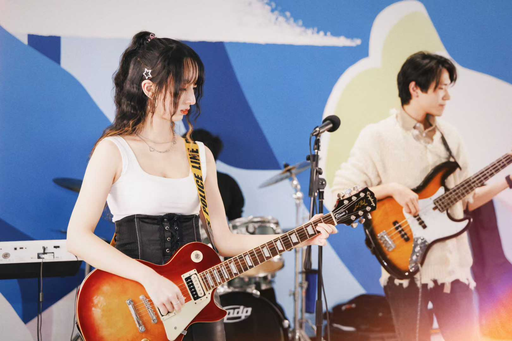
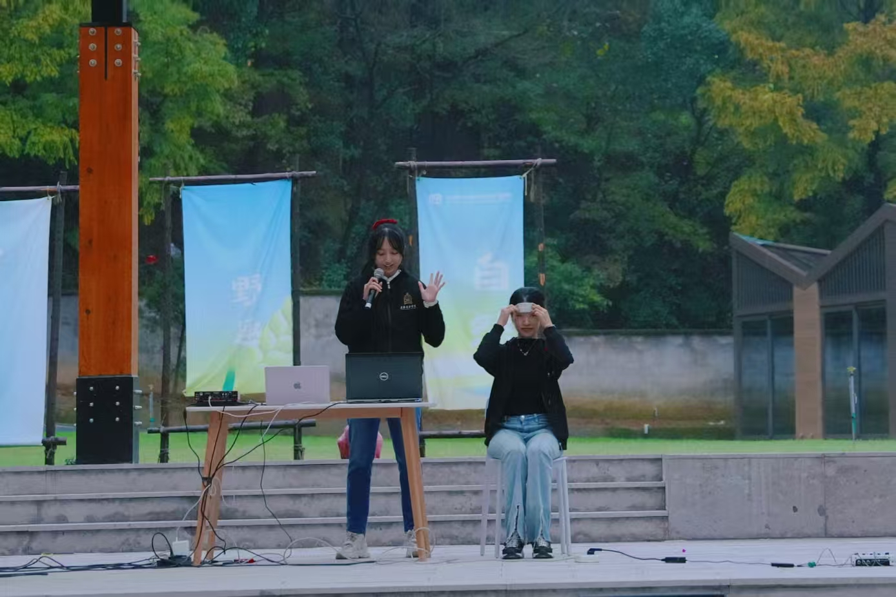

## MOMENTS

    

        <!-- 原始照片 -->
        

        

        

        

        

        

        

        

        

        

        

        

        <!-- 复制一份用于无缝滚动 -->
        

        

        

        

        

        

        

        

        

        

        

        

    

    

